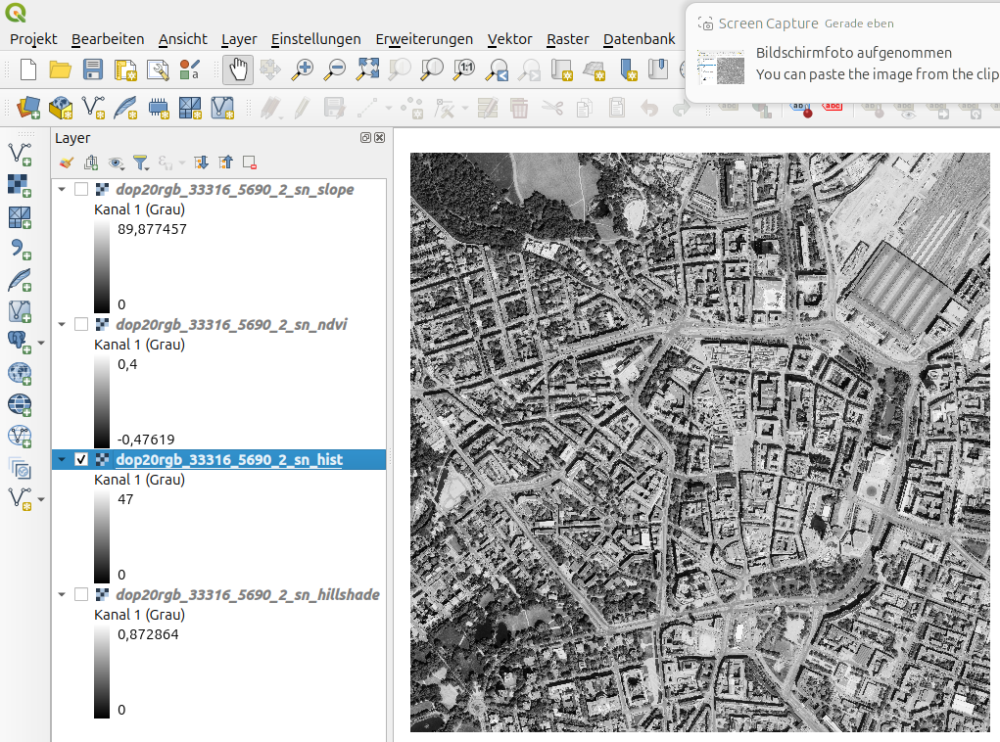

# Raster Impress CLI

**Raster Impress CLI** ist ein Kommandozeilen-Tool für die Analyse von Rasterdaten (GeoTIFF, NetCDF, HDF5) unter Linux/macOS.
Es liefert **Statistiken, Histogramme, NDVI, Slope, Hillshade, Zonal Stats und Visualisierung** und lässt sich direkt als CLI verwenden.

---

## Repository klonen

```bash
git clone https://github.com/deinuser/raster-impress-cli.git
cd raster-impress-cli
```

## Installation der Abhängigkeiten

```bash
pip install -r requirements.txt
python -m pip install --upgrade pip setuptools wheel
```

## Installation als Linux CLI

```bash
sudo apt install pipx
pipx ensurepath
```

```bash
python3 -m venv .venv
source .venv/bin/activate
pip install --upgrade pip setuptools wheel
pip install -e .
# oder systemweit mit pipx
pipx install --editable . --include-deps
```

```bash
raster-impress --version
```

* Prüfe, dass `~/.local/bin` in deinem `$PATH` ist:

```bash
export PATH="$HOME/.local/bin:$PATH"
```

* CLI aufrufen:

```bash
man raster-impress
```

```bash
raster-impress --version
```

```bash
raster-impress --help
```

## Rasterdaten ablegen

```bash
mkdir -p ~/raster_data
cp my_raster.tif ~/raster_data/
```

## Manpage installieren (Linux)

```bash
sudo cp docs/raster-impress.1 /usr/share/man/man1/
sudo mandb
man raster-impress
```

## Tests ausführen

```bash
pip install pytest
pytest tests -v
```

## CLI-Parameter

```bash
raster-impress --help
usage: raster-impress [-h] [--stats] [--histogram [HISTOGRAM]] [--ndvi [NDVI]] [--slope [SLOPE]]
                      [--hillshade [HILLSHADE]] [--metadata] [--quality] [--silent] [--version]
                      filepath

Raster analysis tool with automatic TIF and plot generation

positional arguments:
  filepath              Path to input raster file

options:
  -h, --help            show this help message and exit
  --stats               Compute basic statistics
  --histogram [HISTOGRAM]
                        Compute histogram. Optional output filename; default adds '_hist.tif' to input raster
  --ndvi [NDVI]         Compute NDVI (requires at least 2 bands). Optional output filename; default adds '_ndvi.tif'
                        to input raster
  --slope [SLOPE]       Compute slope (DEM required). Optional output filename; default adds '_slope.tif' to input
                        raster
  --hillshade [HILLSHADE]
                        Compute hillshade (DEM required). Optional output filename; default adds '_hillshade.tif' to
                        input raster
  --metadata            Show raster metadata
  --quality             Perform quality check
  --silent              Suppress log output
  --version             show program's version number and exit
```

## CI/CD Pipeline (GitHub Actions)

* `.github/workflows/python-package.yml`
* Repository auschecken
* Python >= 3.11 installieren
* Abhängigkeiten installieren
* Tests ausführen
* Linting mit flake8
* Push/PR auf `main` löst automatische Ausführung aus


## Zusammenfassung der Befehle

```bash

# Vollanalyse mit allen Funktionen ohne Speicherpfad
raster-impress dop20rgb_33316_5690_2_sn.tif --stats --histogram --ndvi --slope --hillshade --metadata --quality

# Analyse von Slope und NDVI mit und ohne Speicherpfad
raster-impress dop20rgb_33316_5690_2_sn.tif --slope output/myslope.tif --ndvi output/myndvi.tif
raster-impress dop20rgb_33316_5690_2_sn.tif --slope --ndvi
```

# Beispiele





## Datenquelle

Genutzete-DOP-Daten:
https://geocloud.landesvermessung.sachsen.de/public.php/dav/files/QQFLq6nkoSnqB5g/?accept=zip&files

Die verwendeten Rasterdaten stammen aus dem amtlichen Digitalen Orthophoto (DOP) des Freistaates Sachsen:  
[Downloadbereich DOP](https://www.geodaten.sachsen.de/downloadbereich-dop-4826.html)

Lizenz: Datenlizenz Deutschland – Namensnennung – Version 2.0  
© Staatsbetrieb Geobasisinformation und Vermessung Sachsen (GeoSN)


## Lizenz

Projekt kann unter MIT-Lizenz oder Open-Source Lizenz genutzt werden.
