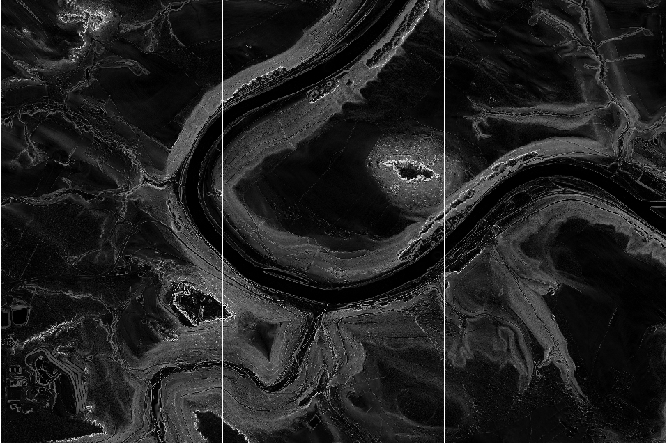
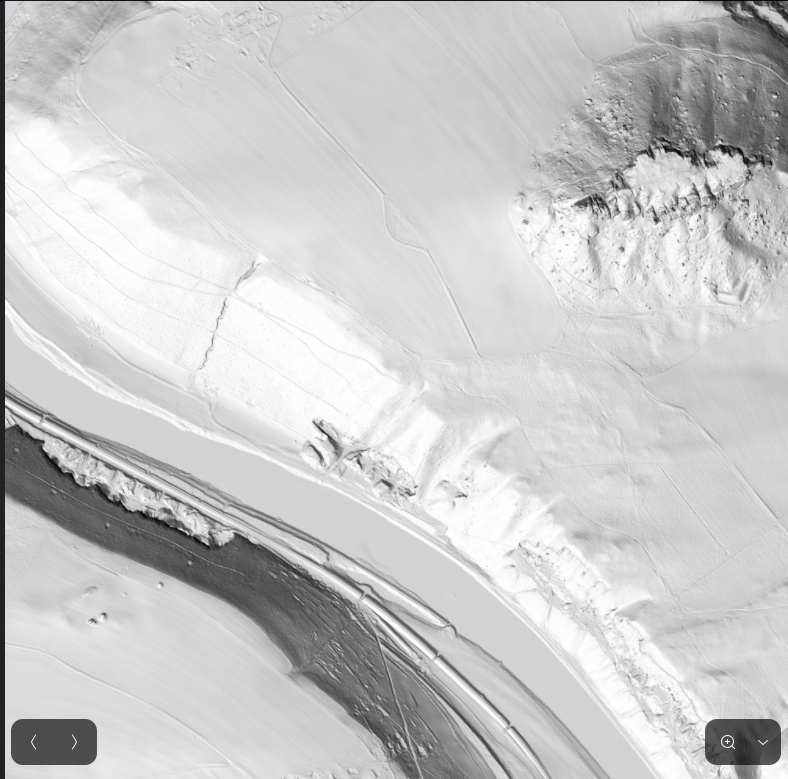
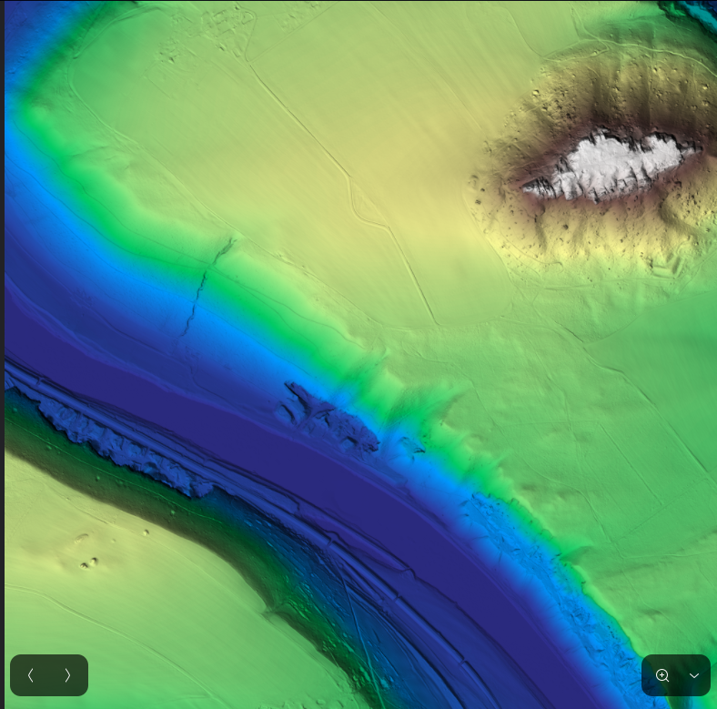
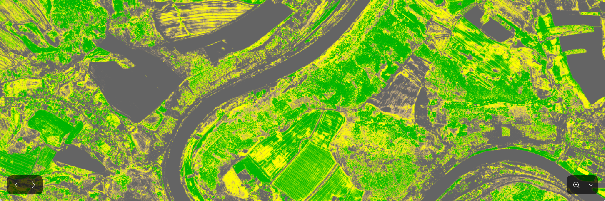
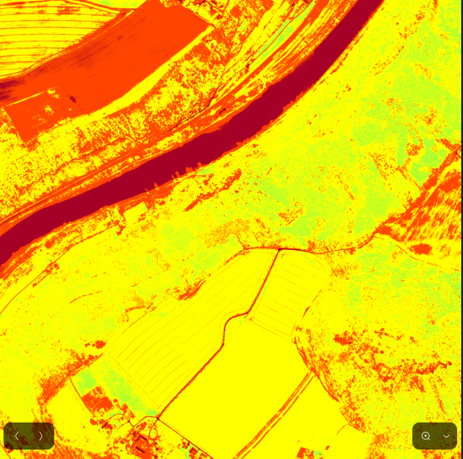
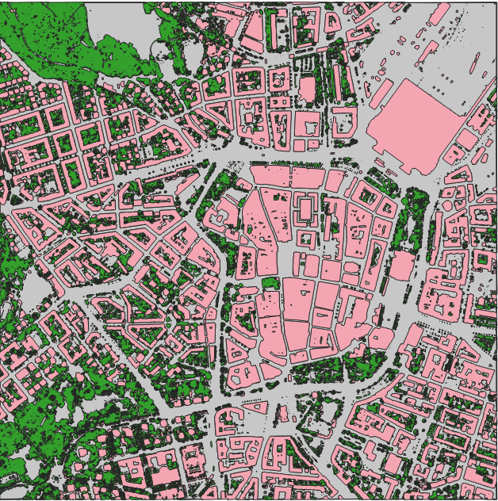

# Raster Impress CLI


**Raster Impress CLI** ist ein Kommandozeilen-Tool für die Analyse von Rasterdaten (z.B. GeoTIFF) unter Linux.

Es liefert:

* 📊 Statistiken
    
* 📈 Histogramme

* 🌱 NDVI (Vegetationsindex)
    
* 🏔️ Slope (Hangneigung)
    
* 🌄 Hillshade (Schummerung)
    
* 🗺️ Relief (synthetisch)
    
* 🧾 Metadaten
    
* ✅ Qualitätsprüfung

Alle Funktionen lassen sich direkt über die CLI ausführen. Dabei lassen sich GeoTIFF's und kleine Vorschau-Plots generieren.

---

## Repository klonen

```bash
git clone https://github.com/deinuser/raster-impress-cli.git
cd raster-impress-cli
```

## Installation der Abhängigkeiten

```bash
pip install -r requirements.txt
python -m pip install --upgrade pip setuptools wheel
```

## Installation als Linux CLI

```bash
sudo apt install pipx
pipx ensurepath
```

```bash
python3 -m venv .venv
source .venv/bin/activate
pip install --upgrade pip setuptools wheel
pip install -e .
# oder systemweit mit pipx
pipx install --editable . --include-deps
```

```bash
raster-impress --version
```

* Prüfe, dass `~/.local/bin` in deinem `$PATH` ist:

```bash
export PATH="$HOME/.local/bin:$PATH"
```

* CLI aufrufen:

```bash
man raster-impress
```

```bash
raster-impress --version
```

```bash
raster-impress --help
```

## Rasterdaten ablegen

```bash
mkdir -p ~/raster_data
cp my_raster.tif ~/raster_data/
```

## Manpage installieren (Linux)

```bash
sudo cp docs/raster-impress.1 /usr/share/man/man1/
sudo mandb
man raster-impress
```

## Tests ausführen

```bash
pip install pytest
pytest tests -v
```

## CLI-Parameter

```bash
usage: raster-impress [-h] [--stats] [--histogram [HISTOGRAM]] [--ndvi [NDVI]] 
                      [--slope [SLOPE]] [--hillshade [HILLSHADE]]
                      [--relief [RELIEF]] [--metadata] [--quality] [--extract DSM DGM]
                      [--silent] [--version]
                      filepath

Raster analysis tool with automatic TIF and plot generation

positional arguments:
  filepath              Path to input raster file

options:
  -h, --help            show this help message and exit
  --stats               Compute basic statistics
  --histogram [HISTOGRAM]
                        Compute histogram. Optional output filename
  --ndvi [NDVI]         Compute NDVI (requires at least 2 bands). Optional output filename
  --slope [SLOPE]       Compute Slope (DEM required). Optional output filename
  --hillshade [HILLSHADE]
                        Compute Hillshade (DEM required). Optional output filename
  --relief [RELIEF]     Compute synthetic Relief (DEM required). Optional output filename
  --metadata            Show raster metadata
  --quality             Perform quality check
  --extract DSM DGM     Extract features: vegetation, impervious surfaces and buildings
  --output OUTPUT       Specify output folder for results (default: current directory)
  --silent              Suppress log output
  --version             Show program's version number and exit
```

## CI/CD Pipeline (GitHub Actions)

* `.github/workflows/python-package.yml`
* Repository auschecken
* Python >= 3.11 installieren
* Abhängigkeiten installieren
* Tests ausführen
* Linting mit flake8
* Push/PR auf `main` löst automatische Ausführung aus


## Zusammenfassung der Befehle

```bash

# Multi-Analyse
raster-impress dem.tif --slope --hillshade --relief --metadata --quality

# Einzel-Analyse
raster-impress dem.tif --slope --output test
raster-impress dem.tif --hillshade --output test
raster-impress dem.tif --relief --output test

raster-impress dop.tif --ndvi --output test
raster-impress dop.tif --extract dsm.tif dem.tif --output test
```

## Beispiele

| Beschriftung    | Bild                                        |
|-----------------|---------------------------------------------|
| Slope           |      |
| Hillshade       |   |
| Relief          |    |
| NDVI City       |        |
| NDVI Landscape  |      |
| Extraction      |  |

## Datenquelle

Offene Geodaten des Freistaates Sachsen:
[Downloadbereich Offene Geodaten](https://www.geodaten.sachsen.de/index.html)

Lizenz: Datenlizenz Deutschland – Namensnennung – Version 2.0  
© Staatsbetrieb Geobasisinformation und Vermessung Sachsen (GeoSN)


## Lizenz

Projekt kann unter MIT-Lizenz oder Open-Source Lizenz genutzt werden.
